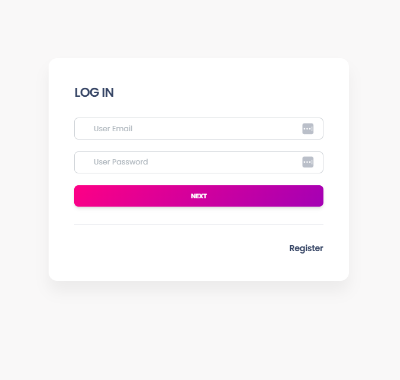
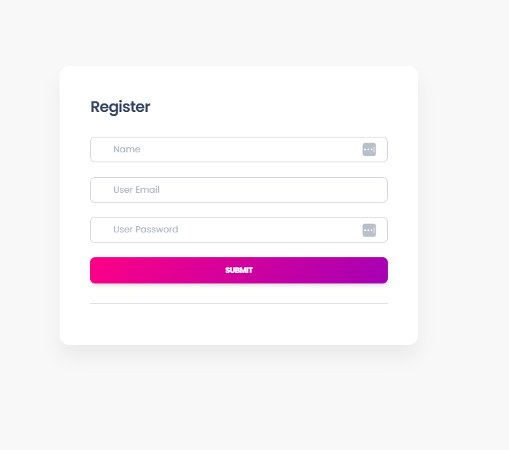
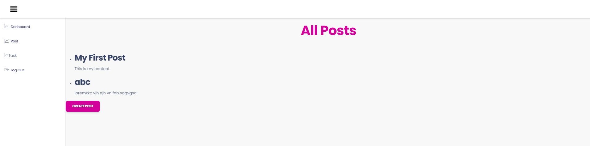
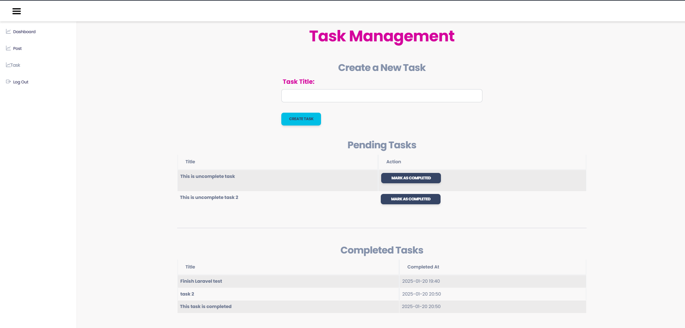

# Laravel Coding Test

This project is a Laravel-based web application that implements various features like task management, blog post creation, and user authentication. It includes API endpoints to manage tasks and posts, as well as a basic front-end for managing these tasks and posts.

## Features
- User Registration & Login
- CRUD operations for Blog Posts
- Task Management with pending and completed tasks
## Installation Process

Follow these steps to set up the project locally:

### Prerequisites:
- PHP >= 7.4
- Composer
- MySQL or any other preferred database
- Laravel 8 or above

### Steps:

- **Step 1: Clone the repository**
  ```bash
  git clone https://github.com/labib108/laravel_codding_test.git
  cd laravel_codding_test
- **Step 2: Install dependencies**  
  ```bash
  composer install
- **Step 3: Set up the environment file**  
  ```bash
  DB_CONNECTION=mysql 
  DB_HOST=127.0.0.1
  DB_PORT=3306
  DB_DATABASE=your_database_name
  DB_USERNAME=your_database_username
  DB_PASSWORD=your_database_password

 - **Step 4: Generate the application key** 
  ```bash
  php artisan key:generate

- **Step 5: Run migrations and Serve**  
  ```bash
  php artisan migrate
  ```bash
  php artisan serve
  
# Screenshots




 